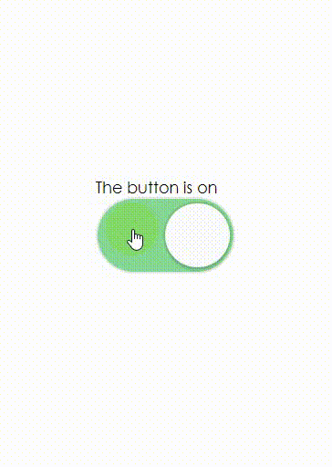

The Compound Components Pattern enables you to provide a set of
components that implicitly share state for a simple yet powerful declarative API
for reusable components.

Compound components are components that work together to form a complete UI. The
classic example of this is `<select>` and `<option>` in HTML:

```html
<select>
  <option value="1">Option 1</option>
  <option value="2">Option 2</option>
</select>
```

```javascript
import * as React from 'react'
import { Switch } from '../switch'

function Toggle({ children }) {
  const [on, setOn] = React.useState(false)
  const toggle = () => setOn(!on)
  return React.Children.map(children, child => {
    return typeof child.type === 'string'
      ? child
      : React.cloneElement(child, { on, toggle })
  })
}

function ToggleOn({ on, children }) {
  return on ? children : null
}

function ToggleOff({ on, children }) {
  return on ? null : children
}

function ToggleButton({ on, toggle, ...props }) {
  return <Switch on={on} onClick={toggle} {...props} />
}

function App() {
  return (
    <div>
      <Toggle>
        <ToggleOn>The button is on</ToggleOn>
        <ToggleOff>The button is off</ToggleOff>
        <span>Hello</span>
        <ToggleButton />
      </Toggle>
    </div>
  )
}

export default App
```



