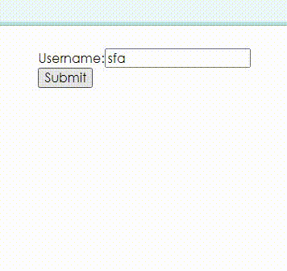

## Background

In React, there actually aren't a ton of things you have to learn to interact
with forms. You can attach a submit handler to a form element with the `onSubmit` prop. This
will be called with the submit event which has a `target`. That `target` is a
reference to the `<form>` DOM node which has a reference to the elements of the
form which can be used to get the values out of the form!

There are several ways to get the value of the name input:

- Via their index: `event.target.elements[0].value`
- Via the elements object by their `name` or `id` attribute:
  `event.target.elements.usernameInput.value`
- Via using refs

Here's an example via their elements:

```jsx
import * as React from 'react'

function UsernameForm({ onSubmitUsername }) {
  const [username, setUsername] = React.useState('')

  function handleSubmit(event) {
    event.preventDefault()
    onSubmitUsername(username)
  }

  function handleChange(event) {
    setUsername(event.target.value.toLowerCase())
  }

  return (
    <form onSubmit={handleSubmit}>
      <div>
        <label htmlFor='usernameInput'>Username:</label>
        <input
          id='usernameInput'
          type='text'
          onChange={handleChange}
          value={username}
        />
      </div>
      <button type='submit'>Submit</button>
    </form>
  )
}

function App() {
  const onSubmitUsername = username => alert(`You entered: ${username}`)
  return (
    <div style={{ minWidth: 400 }}>
      <UsernameForm onSubmitUsername={onSubmitUsername} />
    </div>
  )
}

export default App
```

Here's an example via using refs:

```jsx
import * as React from 'react'

function UsernameForm({ onSubmitUsername }) {
  const usernameInputRef = React.useRef()

  function handleSubmit(event) {
    event.preventDefault()
    onSubmitUsername(usernameInputRef.current.value)
  }

  return (
    <form onSubmit={handleSubmit}>
      <div>
        <label htmlFor='usernameInput'>Username:</label>
        <input id='usernameInput' type='text' ref={usernameInputRef} />
      </div>
      <button type='submit'>Submit</button>
    </form>
  )
}

function App() {
  const onSubmitUsername = username => alert(`You entered: ${username}`)
  return <UsernameForm onSubmitUsername={onSubmitUsername} />
}

export default App
```


