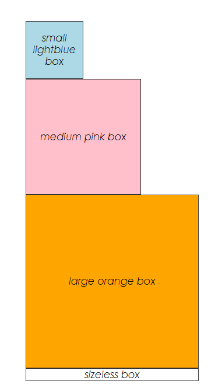

## Background

There are two primary ways to style react components

1. Inline styles with the `style` prop
2. Regular CSS with the `className` prop

**About the `style` prop:**

- In HTML you'd pass a string of CSS:

```html
<div style="margin-top: 20px; background-color: blue;"></div>
```

- In React, you'll pass an object of CSS:

```jsx
<div style={{ marginTop: 20, backgroundColor: 'blue' }} />
```

Note that in react the `{{` and `}}` is actually a combination of a JSX
expression and an object expression. The same example above could be written
like so:

```jsx
const myStyles = {marginTop: 20, backgroundColor: 'blue'}
<div style={myStyles} />
```

**About the `className` prop:**

In HTML, you apply a class name to an element with the
`class` attribute. In JSX, you use the `className` prop.

```jsx
import * as React from 'react'
import '../box-styles.css'

function Box({ style, size, className = '', ...otherProps }) {
  const sizeClassName = size ? `box--${size}` : ''
  return (
    <div
      className={`box ${className} ${sizeClassName}`}
      style={{ fontStyle: 'italic', ...style }}
      {...otherProps}
    />
  )
}

function App() {
  return (
    <div>
      <Box size='small' style={{ backgroundColor: 'lightblue' }}>
        small lightblue box
      </Box>
      <Box size='medium' style={{ backgroundColor: 'pink' }}>
        medium pink box
      </Box>
      <Box size='large' style={{ backgroundColor: 'orange' }}>
        large orange box
      </Box>
      <Box>sizeless box</Box>
    </div>
  )
}

export default App
```


