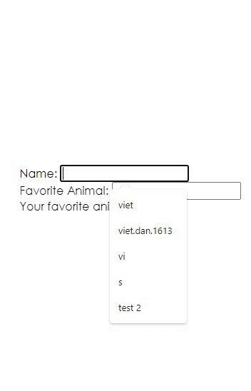

## Background

A common question from React beginners is how to share state between two sibling
components. The answer is to
["lift the state"](https://reactjs.org/docs/lifting-state-up.html)

It becomes natural over time. One thing that we typically have trouble remembering to do is to push state back
down (or [colocate state](https://kentcdodds.com/blog/state-colocation-will-make-your-react-app-faster)).

Here's an example:

```javascript
import * as React from 'react'

function Name() {
  const [name, setName] = React.useState('')
  return (
    <div>
      <label htmlFor="name">Name: </label>
      <input
        id="name"
        value={name}
        onChange={event => setName(event.target.value)}
      />
    </div>
  )
}

function FavoriteAnimal({animal, onAnimalChange}) {
  return (
    <div>
      <label htmlFor="animal">Favorite Animal: </label>
      <input id="animal" value={animal} onChange={onAnimalChange} />
    </div>
  )
}

function Display({animal}) {
  return <div>{`Your favorite animal is: ${animal}!`}</div>
}

function App() {
  const [animal, setAnimal] = React.useState('')
  return (
    <form>
      {/* Colocating state: state only use in child component */}
      <Name />
      {/* Lifting state: state use in child and parent component */}
      <FavoriteAnimal
        animal={animal}
        onAnimalChange={event => setAnimal(event.target.value)}
      />
      {/* Lifting state */}
      <Display animal={animal} />
    </form>
  )
}

export default App
```


