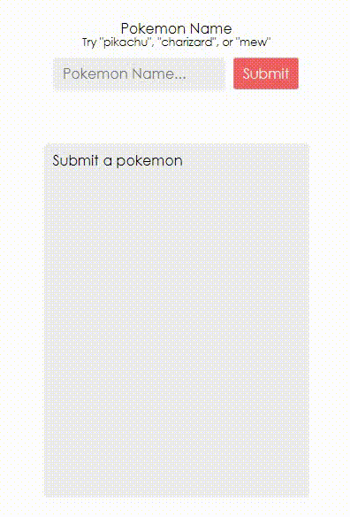

## Background

HTTP requests are another common side-effect that we need to do in applications.
This is no different from the side-effects we need to apply to a rendered DOM or
when interacting with browser APIs like localStorage. In all these cases, we do
that within a `useEffect` hook callback.

One important thing to note about the `useEffect` hook is that you cannot return
anything other than the cleanup function. Instead of using async/await syntax:

```javascript
React.useEffect(() => {
  doSomeAsyncThing().then(result => {
    // do something with the result
  })
})
```

## Handle errors

Unfortunately, sometimes things go wrong and we need to handle errors when they do so we can show the user useful information.

```javascript
// option 1: using .catch
fetchPokemon(pokemonName)
  .then(pokemon => setPokemon(pokemon))
  .catch(error => setError(error))

// option 2: using the second argument to .then
fetchPokemon(pokemonName).then(
  pokemon => setPokemon(pokemon),
  error => setError(error)
)
```

## Use a status

We could make things much simpler by having some state to set the explicit
status of our component. Our component can be in the following "states":

- `idle`: no request made yet
- `pending`: request started
- `resolved`: request successful
- `rejected`: request failed

## Store the state in an object

You can store all of your state in a single object with
a single `React.useState` call so I can update your state like this:

```javascript
setState({ status: 'resolved', pokemon })
```

## Create an ErrorBoundary component

Eventually your app code just isn’t going to behave the way you expect it to and you’ll need to handle those exceptions. If an error
is thrown and unhandled, your application will be removed from the page, leaving
the user with a blank screen... Kind of awkward...

Luckily for us, there’s a simple way to handle errors in your application using
a special kind of component called an
[Error Boundary](https://reactjs.org/docs/error-boundaries.html)

```javascript
function ErrorFallback({ error }) {
  return (
    <div role='alert'>
      There was an error:{' '}
      <pre style={{ whiteSpace: 'normal' }}>{error.message}</pre>
    </div>
  )
}
// <ErrorBoundary FallbackComponent={ErrorFallback}>
//   <PokemonInfo pokemonName={pokemonName} />
// </ErrorBoundary>
```

## Reset the error boundary && use resetKeys

You might notice that with the changes we've added, we now cannot recover from
an error. For example:

1. Type an incorrect pokemon
2. Notice the error
3. Type a correct pokemon
4. Notice it doesn't show that new pokemon's information

The reason this is happening is because the `error` that's stored in the
internal state of the `ErrorBoundary` component isn't getting reset, so it's not
rendering the `children` we're passing to it.

Providing it a `resetKeys` prop which can be used to unmount and
re-mount a component.

```jsx
// function handleReset() {
//   setPokemonName('')
// }

<ErrorBoundary
  FallbackComponent={ErrorFallback}
  onReset={handleReset}
  resetKeys={[pokemonName]}
>
  <PokemonInfo pokemonName={pokemonName} />
</ErrorBoundary>
```

Full example:

```javascript
import * as React from 'react'
import { ErrorBoundary } from 'react-error-boundary'
import {
  fetchPokemon,
  PokemonInfoFallback,
  PokemonForm,
  PokemonDataView
} from '../pokemon'

function PokemonInfo({ pokemonName }) {
  const [state, setState] = React.useState({
    status: pokemonName ? 'pending' : 'idle',
    pokemon: null,
    error: null
  })
  const { status, pokemon, error } = state
  console.log(status)
  React.useEffect(() => {
    if (!pokemonName) {
      return
    }
    setState({ status: 'pending' })
    fetchPokemon(pokemonName).then(
      pokemon => {
        setState({ status: 'resolved', pokemon })
      },
      error => {
        setState({ status: 'rejected', error })
      }
    )
  }, [pokemonName])

  if (status === 'idle') {
    return 'Submit a pokemon'
  } else if (status === 'pending') {
    return <PokemonInfoFallback name={pokemonName} />
  } else if (status === 'rejected') {
    // this will be handled by an error boundary
    throw error
  } else if (status === 'resolved') {
    return <PokemonDataView pokemon={pokemon} />
  }

  throw new Error('This should be impossible')
}

function ErrorFallback({ error, resetErrorBoundary }) {
  return (
    <div role='alert'>
      There was an error:{' '}
      <pre style={{ whiteSpace: 'normal' }}>{error.message}</pre>
      <button onClick={resetErrorBoundary}>Try again</button>
    </div>
  )
}

function App() {
  const [pokemonName, setPokemonName] = React.useState('')

  function handleSubmit(newPokemonName) {
    setPokemonName(newPokemonName)
  }

  function handleReset() {
    setPokemonName('')
  }

  return (
    <div className='pokemon-info-app'>
      <PokemonForm pokemonName={pokemonName} onSubmit={handleSubmit} />
      <hr />
      <div className='pokemon-info'>
        <ErrorBoundary
          FallbackComponent={ErrorFallback}
          onReset={handleReset}
          resetKeys={[pokemonName]}
        >
          <PokemonInfo pokemonName={pokemonName} />
        </ErrorBoundary>
      </div>
    </div>
  )
}

export default App
```


