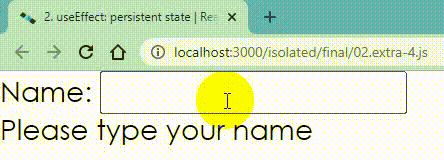

## Background

`React.useEffect` is a built-in hook that allows you to run some custom code
after React renders (and re-renders) your component to the DOM.

Here's an example:

```javascript
React.useEffect(() => {
  // your side-effect code here.
})
```

Full example:

```javascript
import * as React from 'react'

function useLocalStorageState(
  key,
  defaultValue = '',
  // the = {} fixes the error we would get from destructuring when no argument was passed
  // Check https://jacobparis.com/blog/destructure-arguments for a detailed explanation
  { serialize = JSON.stringify, deserialize = JSON.parse } = {}
) {
  const [state, setState] = React.useState(() => {
    const valueInLocalStorage = window.localStorage.getItem(key)
    if (valueInLocalStorage) {
      // the try/catch is here in case the localStorage value was set before
      // we had the serialization in place (like we do in previous extra credits)
      try {
        return deserialize(valueInLocalStorage)
      } catch (error) {
        window.localStorage.removeItem(key)
      }
    }
    return typeof defaultValue === 'function' ? defaultValue() : defaultValue
  })

  const prevKeyRef = React.useRef(key)

  React.useEffect(() => {
    const prevKey = prevKeyRef.current
    if (prevKey !== key) {
      window.localStorage.removeItem(prevKey)
    }
    prevKeyRef.current = key
    window.localStorage.setItem(key, serialize(state))
  }, [key, state, serialize])

  return [state, setState]
}

function Greeting({ initialName = '' }) {
  const [name, setName] = useLocalStorageState('name', initialName)

  function handleChange(event) {
    setName(event.target.value)
  }

  return (
    <div>
      <form>
        <label htmlFor='name'>Name: </label>
        <input value={name} onChange={handleChange} id='name' />
      </form>
      {name ? <strong>Hello {name}</strong> : 'Please type your name'}
    </div>
  )
}

function App() {
  return <Greeting />
}

export default App
```


