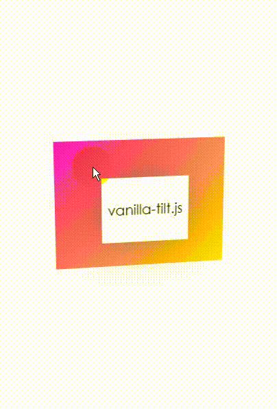

## Background

Often when working with React you'll need to integrate with UI libraries. Some
of these need to work directly with the DOM. Remember that when you do:
`<div>hi</div>` that's actually syntactic sugar for a `React.createElement` so
you don't actually have access to DOM nodes in your function component. In fact,
DOM nodes aren't created at all until the `ReactDOM.render` method is called.
Your function component is really just responsible for creating and returning
React Elements and has nothing to do with the DOM in particular.

So to get access to the DOM, you need to ask React to give you access to a
particular DOM node when it renders your component. The way this happens is
through a special prop called `ref`.

Here's a simple example of using the `ref` prop:

```javascript
function MyDiv() {
  const myDivRef = React.useRef()
  React.useEffect(() => {
    const myDiv = myDivRef.current
    // myDiv is the div DOM node!
    console.log(myDiv)
  }, [])
  return <div ref={myDivRef}>hi</div>
}
```

After the component has been rendered, it's considered "mounted." That's when
the React.useEffect callback is called and so by that point, the ref should have
its `current` property set to the DOM node. So often you'll do direct DOM
interactions/manipulations in the `useEffect` callback.

Full example:

```javascript
import * as React from 'react'
import VanillaTilt from 'vanilla-tilt'

function Tilt({ children }) {
  const tiltRef = React.useRef()

  React.useEffect(() => {
    const { current: tiltNode } = tiltRef
    const vanillaTiltOptions = {
      max: 25,
      speed: 400,
      glare: true,
      'max-glare': 0.5
    }
    VanillaTilt.init(tiltNode, vanillaTiltOptions)
    return () => tiltNode.vanillaTilt.destroy()
  }, [])

  return (
    <div ref={tiltRef} className='tilt-root'>
      <div className='tilt-child'>{children}</div>
    </div>
  )
}

function App() {
  return (
    <Tilt>
      <div className='totally-centered'>vanilla-tilt.js</div>
    </Tilt>
  )
}

export default App
```


