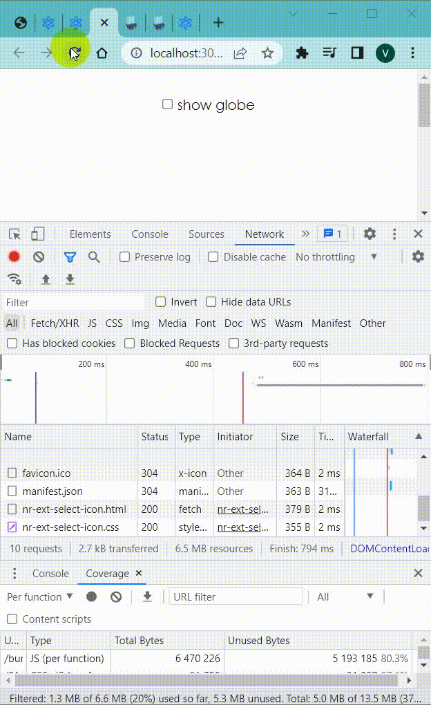
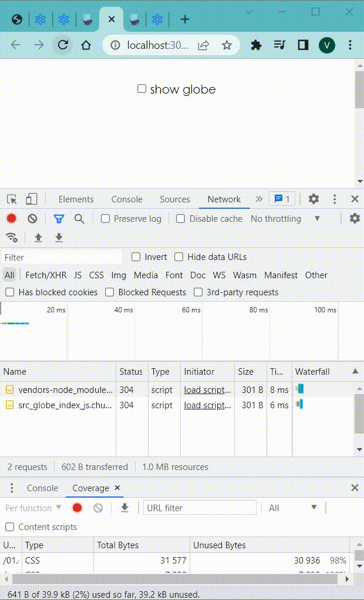
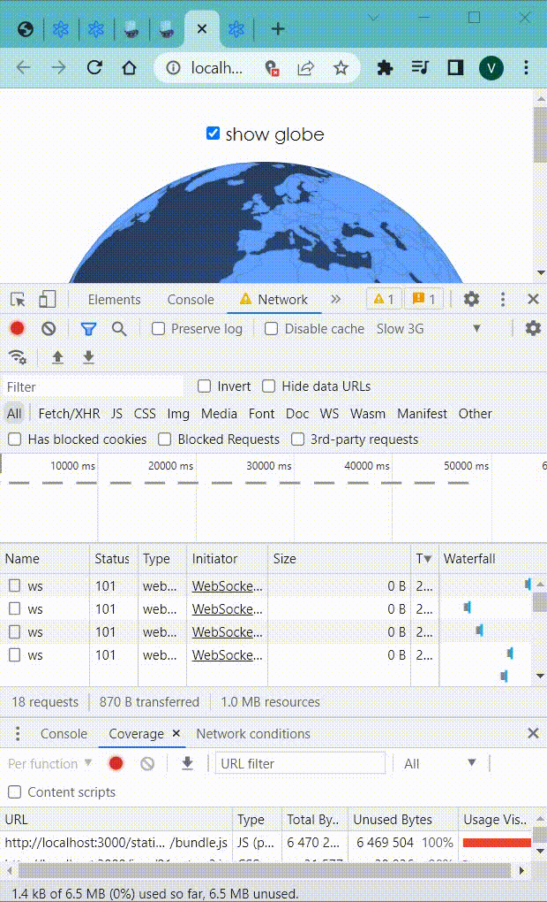

## Using

Code splitting acts on the principle that loading less code `React.lazy(() => import('./smiley-face'))`

Eager loading: load code when `mouseOver` or `focus` to the `<label>` 

Webpack magic comments: `React.lazy(() => import(/* webpackPrefetch: true */ '../globe'))`

## Background

Code splitting acts on the principle that loading less code will speed up your
app. Say for example that we're building a complex dashboard application that
includes the venerable d3 library for graphing data. Your users start
complaining because it takes too long to load the login screen.

```javascript
import('/some-module.js').then(
  module => {
    // do stuff with the module's exports
  },
  error => {
    // there was some error loading the module...
  },
)
```

To take this further, React has built-in support for loading modules as React
components. The module must have a React component as the default export, and
you have to use the `<React.Suspense />` component to render a fallback value
while the user waits for the module to be loaded.

```javascript
// smiley-face.js
import * as React from 'react'

function SmileyFace() {
  return <div>😃</div>
}

export default SmileyFace

// app.js
import * as React from 'react'

const SmileyFace = React.lazy(() => import('./smiley-face'))

function App() {
  return (
    <div>
      <React.Suspense fallback={<div>loading...</div>}>
        <SmileyFace />
      </React.Suspense>
    </div>
  )
}
```


## eager loading

So it's great that the users can get the app loaded faster, but it's annoying
when 99% of the time the reason the users are using the app is so they can
interact with our globe. We don't want to have to make them wait first to load
the app and then again to load the globe. Wouldn't it be cool if we could have
globe start loading as soon as the user hovers over the checkbox? So if they
`mouseOver` or `focus` the `<label>` for the checkbox, we should kick off a
dynamic import for the globe module.



## webpack magic comments
<!--  -->

If you're using webpack to bundle your application, then you can use webpack
[magic comments](https://webpack.js.org/api/module-methods/#magic-comments) to
have webpack instruct the browser to prefetch dynamic imports:

```javascript
import(/* webpackPrefetch: true */ './some-module.js')
```

When webpack sees this comment, it adds this to your document's `head`:

```javascript
<link rel="prefetch" as="script" href="/static/js/1.chunk.js">
```


## Full example

```javascript
import * as React from 'react'

const Globe = React.lazy(() => import(/* webpackPrefetch: true */ '../globe'))

function App() {
  const [showGlobe, setShowGlobe] = React.useState(false)

  return (
    <div
      style={{
        display: 'flex',
        alignItems: 'center',
        flexDirection: 'column',
        justifyContent: 'center',
        height: '100%',
        padding: '2rem',
      }}
    >
      <label style={{marginBottom: '1rem'}}>
        <input
          type="checkbox"
          checked={showGlobe}
          onChange={e => setShowGlobe(e.target.checked)}
        />
        {' show globe'}
      </label>
      <div style={{width: 400, height: 400}}>
        <React.Suspense fallback={<div>loading globe...</div>}>
          {showGlobe ? <Globe /> : null}
        </React.Suspense>
      </div>
    </div>
  )
}

export default App
```

<!--  -->
