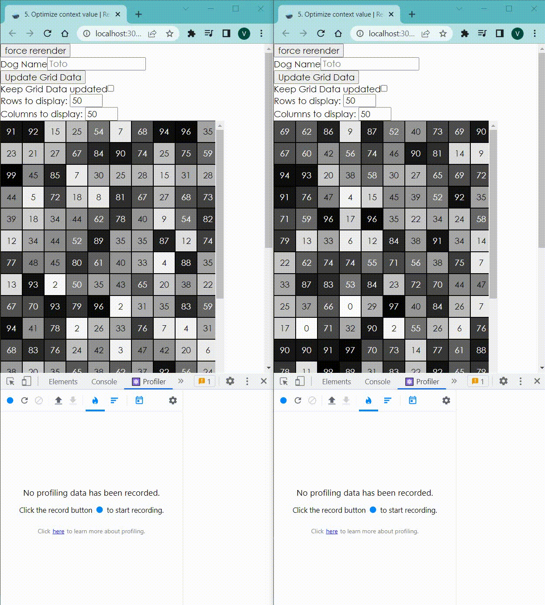

## Using

Change `const value = [count, setCount]` to `const value = React.useMemo(() => [count, setCount], [count])`

## Background

The way that context works is that whenever the provided value changes from one
render to another, it triggers a re-render of all the consuming components
(which will re-render whether or not they're memoized).

So take this for example:

```jsx
const CountContext = React.createContext()

function CountProvider(props) {
  const [count, setCount] = React.useState(0)
  const value = [count, setCount]
  return <CountContext.Provider value={value} {...props} />
}
```

Every time the `<CountProvider />` is re-rendered, the `value` is brand new, so
even though the `count` value itself may stay the same, all component consumers
will be re-rendered.

The quick and easy solution to this problem is to memoize the value that you
provide to the context provider:

```jsx
const CountContext = React.createContext()

function CountProvider(props) {
  const [count, setCount] = React.useState(0)
  const value = React.useMemo(() => [count, setCount], [count])
  return <CountContext.Provider value={value} {...props} />
}
```
## Separate the contexts

When you click one of the cells, it updates that individual cell. But the Grid
itself is re-rendering as well!

The reason this is happening is because the `Grid` consumes the provider value
and when the state changes, that triggers a re-render of all consumers. But
wait... the `Grid` doesn't really depend on the part of the value that's
changing, right? It only needs the `dispatch` function.

```javascript
import * as React from 'react'
import {
  useForceRerender,
  useDebouncedState,
  AppGrid,
  updateGridState,
  updateGridCellState,
} from '../utils'

const AppStateContext = React.createContext()
const AppDispatchContext = React.createContext()

const initialGrid = Array.from({length: 100}, () =>
  Array.from({length: 100}, () => Math.random() * 100),
)

function appReducer(state, action) {
  switch (action.type) {
    case 'TYPED_IN_DOG_INPUT': {
      return {...state, dogName: action.dogName}
    }
    case 'UPDATE_GRID_CELL': {
      return {...state, grid: updateGridCellState(state.grid, action)}
    }
    case 'UPDATE_GRID': {
      return {...state, grid: updateGridState(state.grid)}
    }
    default: {
      throw new Error(`Unhandled action type: ${action.type}`)
    }
  }
}

function AppProvider({children}) {
  const [state, dispatch] = React.useReducer(appReducer, {
    dogName: '',
    grid: initialGrid,
  })
  return (
    <AppStateContext.Provider value={state}>
      <AppDispatchContext.Provider value={dispatch}>
        {children}
      </AppDispatchContext.Provider>
    </AppStateContext.Provider>
  )
}

function useAppState() {
  const context = React.useContext(AppStateContext)
  if (!context) {
    throw new Error('useAppState must be used within the AppProvider')
  }
  return context
}

function useAppDispatch() {
  const context = React.useContext(AppDispatchContext)
  if (!context) {
    throw new Error('useAppDispatch must be used within the AppProvider')
  }
  return context
}

function Grid() {
  const dispatch = useAppDispatch()
  const [rows, setRows] = useDebouncedState(50)
  const [columns, setColumns] = useDebouncedState(50)
  const updateGridData = () => dispatch({type: 'UPDATE_GRID'})
  return (
    <AppGrid
      onUpdateGrid={updateGridData}
      rows={rows}
      handleRowsChange={setRows}
      columns={columns}
      handleColumnsChange={setColumns}
      Cell={Cell}
    />
  )
}
Grid = React.memo(Grid)

function Cell({row, column}) {
  const state = useAppState()
  const cell = state.grid[row][column]
  const dispatch = useAppDispatch()
  const handleClick = () => dispatch({type: 'UPDATE_GRID_CELL', row, column})
  return (
    <button
      className="cell"
      onClick={handleClick}
      style={{
        color: cell > 50 ? 'white' : 'black',
        backgroundColor: `rgba(0, 0, 0, ${cell / 100})`,
      }}
    >
      {Math.floor(cell)}
    </button>
  )
}
Cell = React.memo(Cell)

function DogNameInput() {
  const state = useAppState()
  const dispatch = useAppDispatch()
  const {dogName} = state

  function handleChange(event) {
    const newDogName = event.target.value
    dispatch({type: 'TYPED_IN_DOG_INPUT', dogName: newDogName})
  }

  return (
    <form onSubmit={e => e.preventDefault()}>
      <label htmlFor="dogName">Dog Name</label>
      <input
        value={dogName}
        onChange={handleChange}
        id="dogName"
        placeholder="Toto"
      />
      {dogName ? (
        <div>
          <strong>{dogName}</strong>, I've a feeling we're not in Kansas anymore
        </div>
      ) : null}
    </form>
  )
}
function App() {
  const forceRerender = useForceRerender()
  return (
    <div className="grid-app">
      <button onClick={forceRerender}>force rerender</button>
      <AppProvider>
        <div>
          <DogNameInput />
          <Grid />
        </div>
      </AppProvider>
    </div>
  )
}

export default App
```

## Example


