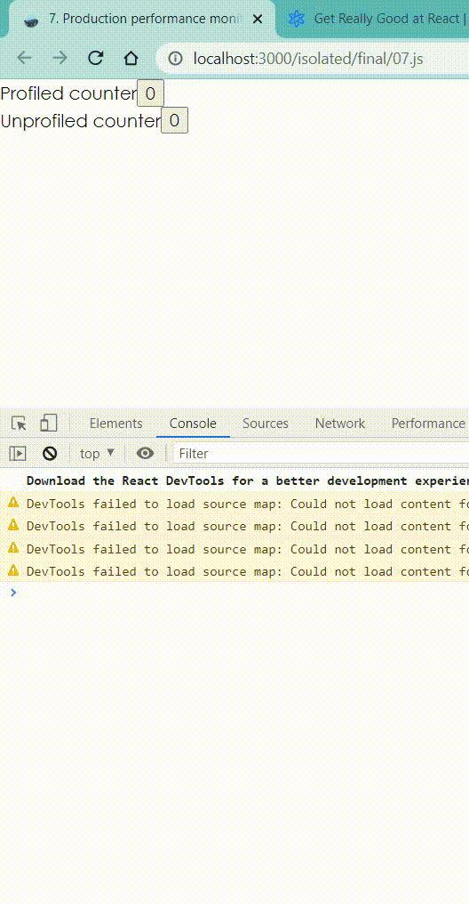

## Using

Reproduce slow bug in production mode

## Background

We should always ship fast experiences to our users, but sometimes something
slips through our PR review process and our users start having a slow
experience. Unless they complain to us, we have no way of knowing that things
are going so slow for them. User complaints is not a great policy for quality
control.

Because we can't make every user install the React DevTools and profile the app
for us as they interact with it, it would be nice if we could somehow track some
of the render times and get that information sent to our servers for us to
monitor.

Well, the React team has created an API specifically for this. It doesn't give
us quite as much information as the React DevTools do, but it does give us some
useful information

```javascript
import * as React from 'react'
import reportProfile from '../report-profile'

function Counter() {
  const [count, setCount] = React.useState(0)
  const increment = () => setCount(c => c + 1)
  return <button onClick={increment}>{count}</button>
}

function App() {
  return (
    <div>
      <React.Profiler id="counter" onRender={reportProfile}>
        <div>
          Profiled counter
          <Counter />
        </div>
      </React.Profiler>
      <div>
        Unprofiled counter
        <Counter />
      </div>
    </div>
  )
}

export default App
```

## Example


