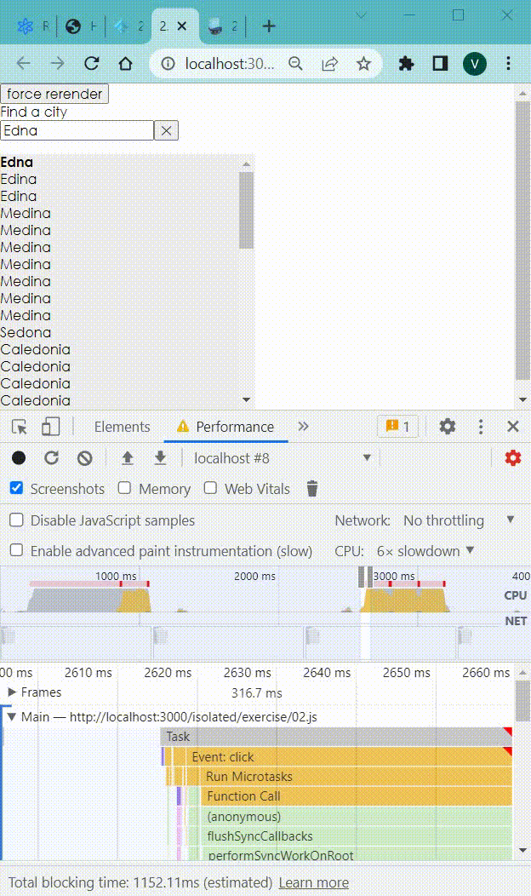

## Using 

To fix "re-render method" equivalent for a class

## Background

This power comes with an unfortunate limitation that calculations performed
within render will be performed every single render, regardless of whether the
inputs for the calculations change. For example:

```jsx
function Distance({x, y}) {
  const distance = calculateDistance(x, y)
  return (
    <div>
      The distance between {x} and {y} is {distance}.
    </div>
  )
}
```

To fix it use `useMemo` hook from React:

```jsx
function Distance({x, y}) {
  const distance = React.useMemo(() => calculateDistance(x, y), [x, y])
  return (
    <div>
      The distance between {x} and {y} is {distance}.
    </div>
  )
}
```

## Put getItems into a Web Worker

```jsx
import * as React from 'react'
import {useCombobox} from '../use-combobox'
import {getItems} from '../workerized-filter-cities'
import {useAsync, useForceRerender} from '../utils'

function Menu({
  items,
  getMenuProps,
  getItemProps,
  highlightedIndex,
  selectedItem,
}) {
  return (
    <ul {...getMenuProps()}>
      {items.map((item, index) => (
        <ListItem
          key={item.id}
          getItemProps={getItemProps}
          item={item}
          index={index}
          selectedItem={selectedItem}
          highlightedIndex={highlightedIndex}
        >
          {item.name}
        </ListItem>
      ))}
    </ul>
  )
}

function ListItem({
  getItemProps,
  item,
  index,
  selectedItem,
  highlightedIndex,
  ...props
}) {
  const isSelected = selectedItem?.id === item.id
  const isHighlighted = highlightedIndex === index
  return (
    <li
      {...getItemProps({
        index,
        item,
        style: {
          fontWeight: isSelected ? 'bold' : 'normal',
          backgroundColor: isHighlighted ? 'lightgray' : 'inherit',
        },
        ...props,
      })}
    />
  )
}

function App() {
  const forceRerender = useForceRerender()
  const [inputValue, setInputValue] = React.useState('')

  const {data: allItems, run} = useAsync({data: [], status: 'pending'})
  React.useEffect(() => {
    run(getItems(inputValue))
  }, [inputValue, run])
  const items = allItems.slice(0, 100)

  const {
    selectedItem,
    highlightedIndex,
    getComboboxProps,
    getInputProps,
    getItemProps,
    getLabelProps,
    getMenuProps,
    selectItem,
  } = useCombobox({
    items,
    inputValue,
    onInputValueChange: ({inputValue: newValue}) => setInputValue(newValue),
    onSelectedItemChange: ({selectedItem}) =>
      alert(
        selectedItem
          ? `You selected ${selectedItem.name}`
          : 'Selection Cleared',
      ),
    itemToString: item => (item ? item.name : ''),
  })

  return (
    <div className="city-app">
      <button onClick={forceRerender}>force rerender</button>
      <div>
        <label {...getLabelProps()}>Find a city</label>
        <div {...getComboboxProps()}>
          <input {...getInputProps({type: 'text'})} />
          <button onClick={() => selectItem(null)} aria-label="toggle menu">
            &#10005;
          </button>
        </div>
        <Menu
          items={items}
          getMenuProps={getMenuProps}
          getItemProps={getItemProps}
          highlightedIndex={highlightedIndex}
          selectedItem={selectedItem}
        />
      </div>
    </div>
  )
}

export default App
```

```jsx
import * as React from 'react'
import useInterval from 'use-interval'

function useSafeDispatch(dispatch) {
  const mounted = React.useRef(false)
  React.useLayoutEffect(() => {
    mounted.current = true
    return () => (mounted.current = false)
  }, [])
  return React.useCallback(
    (...args) => (mounted.current ? dispatch(...args) : void 0),
    [dispatch],
  )
}

// Example usage:
// const {data, error, status, run} = useAsync()
// React.useEffect(() => {
//   run(fetchPokemon(pokemonName))
// }, [pokemonName, run])
const defaultInitialState = {status: 'idle', data: null, error: null}
function useAsync(initialState) {
  const initialStateRef = React.useRef({
    ...defaultInitialState,
    ...initialState,
  })
  const [{status, data, error}, setState] = React.useReducer(
    (s, a) => ({...s, ...a}),
    initialStateRef.current,
  )

  const safeSetState = useSafeDispatch(setState)

  const run = React.useCallback(
    promise => {
      if (!promise || !promise.then) {
        throw new Error(
          `The argument passed to useAsync().run must be a promise. Maybe a function that's passed isn't returning anything?`,
        )
      }
      safeSetState({status: 'pending'})
      return promise.then(
        data => {
          safeSetState({data, status: 'resolved'})
          return data
        },
        error => {
          safeSetState({status: 'rejected', error})
          return error
        },
      )
    },
    [safeSetState],
  )

  const setData = React.useCallback(data => safeSetState({data}), [
    safeSetState,
  ])
  const setError = React.useCallback(error => safeSetState({error}), [
    safeSetState,
  ])
  const reset = React.useCallback(() => safeSetState(initialStateRef.current), [
    safeSetState,
  ])

  return {
    // using the same names that react-query uses for convenience
    isIdle: status === 'idle',
    isLoading: status === 'pending',
    isError: status === 'rejected',
    isSuccess: status === 'resolved',

    setData,
    setError,
    error,
    status,
    data,
    run,
    reset,
  }
}

const useForceRerender = () => React.useReducer(x => x + 1, 0)[1]

function debounce(cb, time) {
  let timeout
  return (...args) => {
    clearTimeout(timeout)
    timeout = setTimeout(cb, time, ...args)
  }
}

// this only needs to exist because concurrent mode isn't here yet. When we get
// that then so much of our hack-perf fixes go away!
function useDebouncedState(initialState) {
  const [state, setState] = React.useState(initialState)
  // eslint-disable-next-line react-hooks/exhaustive-deps
  const debouncedSetState = React.useCallback(debounce(setState, 200), [])
  return [state, debouncedSetState]
}

function Interval({onInterval, interval}) {
  useInterval(onInterval, interval)
  return null
}

function AppGrid({
  onUpdateGrid,
  rows,
  handleRowsChange,
  columns,
  handleColumnsChange,
  Cell,
}) {
  const [keepUpdated, setKeepUpdated] = React.useState(false)
  return (
    <div>
      <form onSubmit={e => e.preventDefault()}>
        <div>
          <button type="button" onClick={onUpdateGrid}>
            Update Grid Data
          </button>
        </div>
        <div>
          <label htmlFor="keepUpdated">Keep Grid Data updated</label>
          <input
            id="keepUpdated"
            checked={keepUpdated}
            type="checkbox"
            onChange={e => setKeepUpdated(e.target.checked)}
          />
          {keepUpdated ? (
            <Interval onInterval={onUpdateGrid} interval={500} />
          ) : null}
        </div>
        <div>
          <label htmlFor="rows">Rows to display: </label>
          <input
            id="rows"
            defaultValue={rows}
            type="number"
            min={1}
            max={100}
            onChange={e => handleRowsChange(e.target.value)}
          />
        </div>
        <div>
          <label htmlFor="columns">Columns to display: </label>
          <input
            id="columns"
            defaultValue={columns}
            type="number"
            min={1}
            max={100}
            onChange={e => handleColumnsChange(e.target.value)}
          />
        </div>
      </form>
      <div
        style={{
          width: '100%',
          maxWidth: 410,
          maxHeight: 820,
          overflow: 'scroll',
        }}
      >
        <div style={{width: columns * 40}}>
          {Array.from({length: rows}).map((r, row) => (
            <div key={row} style={{display: 'flex'}}>
              {Array.from({length: columns}).map((c, column) => (
                <Cell key={column} row={row} column={column} />
              ))}
            </div>
          ))}
        </div>
      </div>
    </div>
  )
}

function updateGridState(grid) {
  return grid.map(row => {
    return row.map(cell => (Math.random() > 0.7 ? Math.random() * 100 : cell))
  })
}

function updateGridCellState(grid, {row, column}) {
  return grid.map((cells, rI) => {
    if (rI === row) {
      return cells.map((cell, cI) => {
        if (cI === column) {
          return Math.random() * 100
        }
        return cell
      })
    }
    return cells
  })
}

export {
  useAsync,
  useForceRerender,
  useDebouncedState,
  Interval,
  AppGrid,
  updateGridState,
  updateGridCellState,
}
```

## Example 


